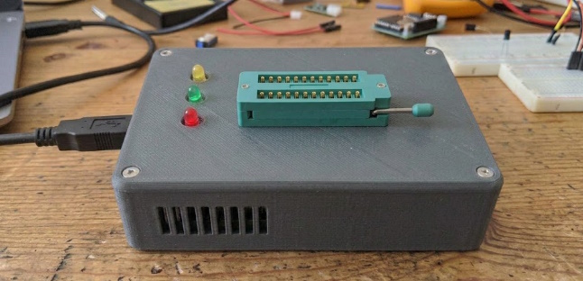

# DRAMmer
Simpe Arduino Mega 2560 shield for testing retro DRAMs, up to 20 pins, including 4116

## 4116 Power.
Only the 4027 and 4116 need -5 V and +12 V as well as +5 V.
The +12 V needs about 35 mA when active, the -5 V is just the substrate bias at a few hundered μA at most.
For +12 V a  boost converter module or circuit would be good enough.
For -5 V a ICL7660, or a more modern IC, like the MAX860 can be used (the latter also has an /SHDN "enable" input).
These chips needed the substrate bias to be applied first on startup and last on shutdown.

## Device list

| IC       | Generic | Manufacturer | Pins  | kb[^1] | b[^2] | Comments                           |
| :------- | :------ | :----------- | :---: | -----: | :---: | :--------------------------------- |
| MK4027   | 4027    | Mostek       |  16   |    4   |   1   | +5 V, -5 V, and +12 V required     |
| MK4116   | 4116    | Mostek       |  16   |   16   |   1   | +5 V, -5 V, and +12 V required     |
| TMS4164  | 4164    | TI           |  16   |   64   |   1   | IBM PC/XT, Commodore 64            |
| HM50256  | 41256   | Hitachi      |  16   |  256   |   1   | IBM PC/AT, Amiga 500, Atari ST     |
| HM511000 | 511000  | Hitachi      |  18   | 1024   |   1   | PC 486, Atari Mega ST2/ST4         |
| TMS4416  | 4416    | TI           |  18   |   64   |   4   | Atari XL/XE                        |
| TMS4464  | 4464    | TI           |  18   |  256   |   4   | Commodore 128, MSX2                |
| HM514256 | 514256  | Hitachi      |  20   | 1024   |   4   |                                    |
| HM514400 | 514400  | Hitachi      |  20   | 4096   |   4   | SIMM                               |
| TMS41164 | 41164   | TI           |  18   |   64   |   1   | high-speed nibble mode / page mode |
| MB81464  | 81464   | Fujitsu      |  18   |  256   |   4   | 4464 but Fast Page Mode (FPM)      |
| MCM6665  | 4164    | Motorola     |  16   |   64   |   1   |                                    |
| μPD41464 | 41464   | NEC          |  18   |  256   |   4   | CGA/EGA graphics adapters          |

[^1]: All sizes use tranditional binary kilo bit/byte notation where 1 k equals 1024.    
[^2]: Width is in bits.